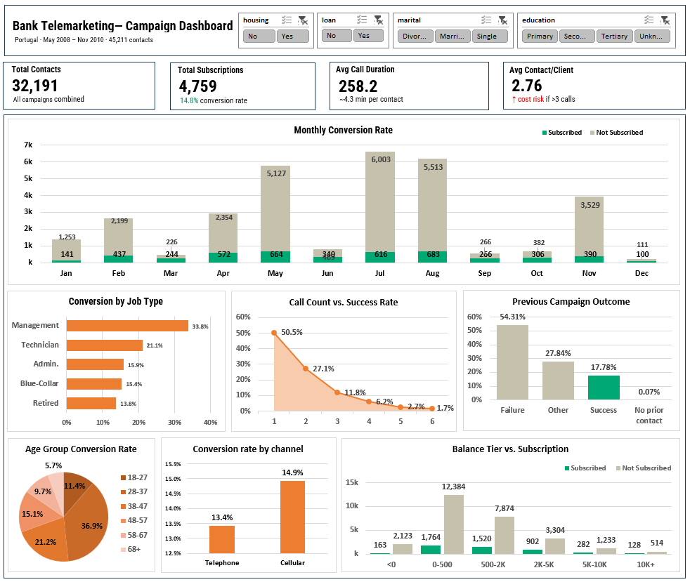

# 📊 Bank Telemarketing Campaign Dashboard

> Analisis kampanye telemarketing deposito berjangka Bank Portugis menggunakan pendekatan CRISP-DM dan visualisasi Tableau.



---

## 📁 Dataset

| Atribut         | Detail                                                                               |
| --------------- | ------------------------------------------------------------------------------------ |
| Sumber          | [UCI Bank Marketing Dataset](https://archive.ics.uci.edu/ml/datasets/Bank+Marketing) |
| Kreator         | Paulo Cortez & Sérgio Moro (Univ. Minho & ISCTE-IUL), 2012                           |
| Total Data      | 45.211 baris (bank-full.csv)                                                         |
| Periode         | Mei 2008 – November 2010                                                             |
| Target Variabel | `y` — apakah nasabah subscribe deposito? (yes/no)                                    |

---

## 🔄 Metodologi: CRISP-DM

### 1. Business Understanding

Sebuah bank Portugis menjalankan kampanye telemarketing untuk menawarkan produk deposito berjangka. Tantangan utama yang dihadapi:

- **Biaya tinggi** — setiap kontak memerlukan waktu dan tenaga agen
- **Conversion rate rendah** — mayoritas kontak tidak menghasilkan subscription
- **Tidak ada prioritisasi** — semua nasabah diperlakukan setara tanpa segmentasi

**Business Problem:**

> Bagaimana meningkatkan efektivitas kampanye telemarketing dengan mengidentifikasi nasabah yang paling berpotensi subscribe, serta meminimalkan kontak yang tidak efektif?

**Pertanyaan Bisnis:**

1. Profil nasabah mana yang paling sering subscribe?
2. Bulan dan channel komunikasi apa yang paling efektif?
3. Berapa jumlah kontak optimal sebelum dianggap tidak produktif?
4. Apakah riwayat kampanye sebelumnya mempengaruhi peluang konversi?

---

### 2. Data Understanding

Dataset memiliki **17 variabel** yang dibagi menjadi tiga kelompok:

**Data Nasabah:**
| Variabel | Tipe | Keterangan |
|---|---|---|
| `age` | Numerik | Usia nasabah |
| `job` | Kategorikal | Jenis pekerjaan (12 kategori) |
| `marital` | Kategorikal | Status pernikahan |
| `education` | Kategorikal | Tingkat pendidikan |
| `default` | Biner | Memiliki kredit macet? |
| `balance` | Numerik | Rata-rata saldo tahunan (EUR) |
| `housing` | Biner | Memiliki KPR? |
| `loan` | Biner | Memiliki pinjaman pribadi? |

**Data Kontak Kampanye:**
| Variabel | Tipe | Keterangan |
|---|---|---|
| `contact` | Kategorikal | Tipe channel (cellular/telephone) |
| `day` | Numerik | Hari terakhir dihubungi |
| `month` | Kategorikal | Bulan terakhir dihubungi |
| `duration` | Numerik | Durasi call terakhir (detik) |

**Data Historis:**
| Variabel | Tipe | Keterangan |
|---|---|---|
| `campaign` | Numerik | Jumlah kontak dalam kampanye ini |
| `pdays` | Numerik | Hari sejak kontak kampanye sebelumnya (-1 = tidak pernah) |
| `previous` | Numerik | Jumlah kontak sebelum kampanye ini |
| `poutcome` | Kategorikal | Hasil kampanye sebelumnya |

**Catatan Data Cleaning:**

- Nilai `unknown` pada kolom `contact` di-exclude dari analisis channel karena merepresentasikan ketidaklengkapan data, bukan kategori channel yang valid
- Nilai `unknown` pada kolom `poutcome` di-rename menjadi `No prior contact` karena merepresentasikan nasabah yang memang belum pernah dihubungi sebelumnya (bukan missing data)
- Variabel `duration` tidak digunakan sebagai prediktor karena baru tersedia setelah call selesai (feature leakage)

---

### 3. Data Preparation

Langkah-langkah preparasi data yang dilakukan:

- **Filtering** — exclude baris dengan `contact = unknown` untuk analisis channel
- **Bucketing** — pengelompokan usia ke dalam bucket merata per 10 tahun (18–27, 28–37, 38–47, 48–57, 58–67, 68+)
- **Relabeling** — `poutcome = unknown` → `No prior contact`
- **Aggregasi** — perhitungan conversion rate per segmen menggunakan formula:
  ```
  Conversion Rate = COUNT(y = "yes") / COUNT(total) × 100
  ```
- **Formatting** — nilai ribuan diformat menggunakan suffix `k` untuk keterbacaan visualisasi

---

### 4. Modeling / Analysis

Analisis dilakukan secara **deskriptif dan eksploratif** menggunakan Tableau. Tidak menggunakan model machine learning — fokus pada pattern discovery untuk business insight.

**Dimensi analisis yang dibangun:**

| Dimensi              | Visualisasi                 | Insight Utama                                        |
| -------------------- | --------------------------- | ---------------------------------------------------- |
| Tren waktu           | Stacked bar chart (monthly) | Jul–Agustus volume tertinggi; Feb–Mar paling efisien |
| Segmentasi pekerjaan | Horizontal bar (top 5)      | Management 33.8%, Technician 21.1%                   |
| Segmentasi usia      | Pie chart                   | 28–37 tahun dominan di 36.9%                         |
| Efektivitas channel  | Bar chart                   | Cellular 14.9% vs Telephone 13.4%                    |
| Frekuensi kontak     | Line chart                  | Diminishing return mulai kontak ke-3                 |
| Riwayat kampanye     | Bar chart                   | Success history → 17.78% re-conversion               |
| Saldo rekening       | Grouped bar                 | Distribusi merata — balance bukan faktor penentu     |

---

### 5. Evaluation

**Temuan Kunci:**

**📌 Conversion Rate Keseluruhan: 14.8%**
Dari 32.191 kontak teridentifikasi, 4.759 nasabah subscribe. Angka ini menunjukkan lebih dari 85% kontak tidak menghasilkan konversi — mengindikasikan potensi besar efisiensi biaya.

**📌 Segmen Prioritas**

- Pekerjaan: Management (33.8%), Technician (21.1%), Admin (15.9%)
- Usia: 28–37 tahun (36.9% dari total konversi)

**📌 Timing Terbaik**

- Volume tertinggi: Juli (616 subscriber dari 6.003 kontak) dan Agustus (683 dari 5.513)
- Efisiensi rasio terbaik: Februari dan Maret dengan proporsi subscribed lebih tinggi relatif terhadap total kontak

**📌 Channel**

- Cellular: 14.9% conversion rate
- Telephone: 13.4% conversion rate
- Perbedaan 1.5 poin persentase — cellular lebih efektif meski selisih tidak terlalu jauh

**📌 Diminishing Return Kontak**
| Jumlah Kontak | Conversion Rate |
|---|---|
| 1 | 50.5% |
| 2 | 27.1% |
| 3 | 11.8% |
| 4 | 6.2% |
| 5 | 2.7% |
| 6+ | 1.7% |

Setelah kontak ke-3, return turun drastis. Rata-rata 2.76 kontak/nasabah menunjukkan sebagian besar kampanye sudah beroperasi di zona tidak efisien.

**📌 Nilai Riwayat Kampanye**

- Nasabah dengan `poutcome = success`: **17.78%** conversion
- Failure: 54.31% (terbesar, tapi sulit dikonversi)
- No prior contact: 0.07%

---

### 6. Deployment

**Dashboard Tableau** dibangun dengan fitur:

- 7 chart interaktif yang saling terhubung
- 4 filter global: housing loan, personal loan, marital status, education
- Scorecard 4 metrik utama di bagian atas

---

## 💡 Rekomendasi & Action Items

### 🟢 Prioritas Tinggi — Langsung Dapat Dieksekusi

**1. Batasi maksimal 3 kontak per nasabah**
Kontak pertama menghasilkan 50.5% conversion. Setelah kontak ketiga turun ke 11.8%. Hentikan follow-up setelah 3 kontak tanpa respons positif dan realokasikan waktu agen ke prospek baru.

**2. Fokuskan targeting ke segmen Management + usia 28–37 via cellular**
Tiga faktor ini secara konsisten menunjukkan conversion tertinggi. Jadikan kombinasi ketiganya sebagai kriteria prioritas utama seleksi target nasabah.

**3. Bangun daftar retarget dari nasabah dengan riwayat success**
Dengan conversion 17.78% — di atas rata-rata 14.8% — segmen ini adalah investasi paling efisien untuk kampanye berikutnya.

### 🟡 Prioritas Menengah — Perencanaan Kampanye

**4. Intensifkan kampanye di Februari–Maret**
Data menunjukkan rasio subscribed lebih sehat di bulan-bulan awal tahun. Alokasi budget lebih tinggi di periode ini berpotensi meningkatkan efisiensi kampanye.

**5. Perbaiki kelengkapan data channel**
Sejumlah besar data tidak memiliki informasi channel yang valid. Melengkapi data ini akan memperbaiki akurasi analisis dan targeting kampanye berikutnya.

---

## 🛠️ Tools

| Tool                  | Kegunaan                           |
| --------------------- | ---------------------------------- |
| Tableau Desktop       | Visualisasi & dashboard interaktif |
| Microsoft Excel / CSV | Data preprocessing awal            |

---

## 📂 Struktur Repository

```
bank-telemarketing-dashboard/
│
├── data/
│   ├── bank-full.csv          # Dataset original
│   └── bank-cleaned.csv       # Dataset setelah preprocessing
│
├── assets/
│   └── dashboard.png
│
└── README.md
```

---

## 📚 Referensi

S. Moro, R. Laureano and P. Cortez. _Using Data Mining for Bank Direct Marketing: An Application of the CRISP-DM Methodology._ In P. Novais et al. (Eds.), Proceedings of the European Simulation and Modelling Conference - ESM'2011, pp. 117-121, Guimarães, Portugal, October, 2011. EUROSIS.

---

_Dibuat sebagai proyek portofolio analisis data — studi kasus peningkatan efektivitas kampanye telemarketing menggunakan pendekatan CRISP-DM._
